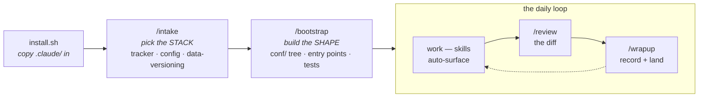

# claude-scaffold — a CV/DS starting point for Claude Code

[](https://github.com/BrendenKennedy/claude-scaffold/actions/workflows/ci.yml)
[](LICENSE)
[](https://github.com/BrendenKennedy/claude-scaffold/releases)

**The problem.** [Claude Code](https://claude.com/claude-code) is a coding agent that works in your
repo, and out of the box it knows nothing about how ML projects go wrong: it will happily write an
unseeded training run, tune a threshold on your test set, hardcode a dataset path, and forget all of
it by the next session. You *can* teach it your conventions — Claude Code reads project config from a
`.claude/` directory (reusable **skills**, focused **subagents**, **hooks** that run around its tool
calls, **slash commands**) — but authoring all of that from scratch is its own project.

**This repo is that project, done.** An opinionated **`.claude/` configuration for computer-vision &
data-science work**: skills, subagents, governance, and memory already shaped around the ML loop —
datasets, training, evaluation, experiment tracking — plus a one-command onboarding that tunes it to
*your* stack.

It's also a worked example of **how to integrate coding agents into an ML workflow**: how skills
auto-surface by trigger, how a `/intake` command rewrites the config to match your tools, how policy
lives as governed canon instead of scattered rules, and how work is remembered across sessions.

> **Assumptions (v1).** PyTorch-centric CV, an **NVIDIA GPU** (local *or* a remote box you SSH into),
> and **uv** for environments. Default tools: **MLflow · Hydra · DVC** (swap them in `/intake`).
> Colab / CPU-only / Apple-MPS aren't covered yet — that's a fast-follow, not a hidden assumption.

## Quick start

**Prerequisites:** [Claude Code](https://claude.com/claude-code) installed, `git`, `bash`, and
[`uv`](https://docs.astral.sh/uv/) in the target project (the scaffold assumes uv for environments).

```bash
# 1. Get the scaffold (clone it once; reuse it for every project):
git clone https://github.com/BrendenKennedy/claude-scaffold.git ~/dev/claude-scaffold

# 2. Drop it into the project you want to scaffold:
cd ~/path/to/my-project
~/dev/claude-scaffold/install.sh .

# 3. Then, inside Claude Code in that project — BOTH, in this order:
/intake      # picks your STACK    (tracker / config / data-versioning)
/bootstrap   # builds the SHAPE    (conf/ tree + entry points the skills describe)
```

`install.sh` copies `.claude/` + `CLAUDE.md` into the target and **never overwrites existing files**
(safe to re-run; it reports what it skipped), marks hooks executable, and stamps
`.claude/scaffold-version` so a project always knows which scaffold version it came from.

**Run both commands, in that order.** `/intake` tunes the config to your tools; `/bootstrap` generates
the project skeleton those tools are configured *for*. Skip `/bootstrap` and the skills document a
project you don't have — `config-hydra` describes a `conf/` tree that isn't there, `training` describes
a `train.py` that isn't there, and "config over constants" governs nothing.

> This repo is a **GitHub template** — you can also hit **"Use this template"** to start a new project
> from it directly, rather than cloning and installing into an existing one.

### The lifecycle at a glance



Setup is two one-time commands; everything after that is the loop on the right.

## The one idea that makes this work: `/intake` + two-tier skills

Skills come in **two tiers: always-on and tool-gated**. The always-on tier has two groups:

- **Chassis** (`governance`, `memory`, `testing`, `wave-planning`) — the *process* skills: how work is
  verified, remembered, governed, and parallelized, whatever you're building.
- **Workflow** (`datasets`, `training`, `evaluation`, `pipelines`, `notebooks`) — the *CV/DS domain*
  skills. Tool-agnostic; they describe the ML work itself and reference whichever tool you chose.

The tool-gated tier is **tool skills** — one tool each (`env-uv`, `tracking-mlflow`, `config-hydra`,
`data-dvc`, …), flipped **on/off** by `settings.json` `skillOverrides`.

**`/intake`** is the switch: it asks which tracker / config system / data-versioning tool you use,
writes `skillOverrides` to enable those and disable the rest, and fills the placeholders your answers
determine (MLflow URI, DVC remote, the ARM torch index if you're on a Grace-Blackwell box, …). Prefer
W&B over MLflow? `/intake` flips it — no edits to the workflow skills that reference "the tracker."

## What's in the box

```
.claude/
├── settings.json            # permissions + hook wiring + skillOverrides (the profile /intake writes)
├── agents/
│   ├── code-reviewer.md      # diff review — correctness + quality + an ML/CV lens
│   ├── software-architect.md # read-only planner (fill in your architecture)
│   ├── ml-engineer.md        # builds models + train/eval loops
│   ├── eval-analyst.md       # read-only: metrics → error-analysis findings
│   ├── data-engineer.md      # dataset ingestion, labels, splits, dataloaders
│   └── _TEMPLATE.md          # copy → new subagent
├── skills/
│   ├── governance/           # policy-canon index + locate→load→apply→record
│   ├── memory/               # session memory + branch-per-session workflow
│   ├── testing/              # verification ladder + ML smokes (fill in the commands)
│   ├── wave-planning/        # decompose one goal into a collision-free parallel build
│   ├── env-uv/               # [tool] uv env + torch/CUDA matrix + GPU sanity
│   ├── tracking-mlflow/      # [tool] MLflow experiment tracking
│   ├── config-hydra/         # [tool] Hydra config composition + sweeps
│   ├── data-dvc/             # [tool] DVC data/model versioning
│   ├── tracking-wandb/       # [tool] Weights & Biases tracking (off by default; /intake flips)
│   ├── datasets/             # splits, label formats (COCO/YOLO/VOC), provenance, leakage
│   ├── training/             # train/fine-tune loop — seeds, checkpoints, resume
│   ├── evaluation/           # metrics (mAP/IoU/PR), eval harness, error analysis
│   ├── pipelines/            # multi-stage cascades — the seam invariants (detect → crop → score)
│   ├── notebooks/            # Jupyter hygiene — logic in modules, strip outputs
│   └── _example/             # how to write a skill (the description/triggers contract)
├── commands/
│   ├── intake.md             # /intake — one-time stack onboarding (the STACK)
│   ├── bootstrap.md          # /bootstrap — one-time project skeleton (the SHAPE) — run after /intake
│   ├── review.md             # /review the current diff
│   ├── wrapup.md             # /wrapup — session close-out
│   └── _TEMPLATE.md
├── hooks/
│   ├── validate-python.py    # PostToolUse: ruff format + check on edited .py
│   ├── validate-bash.sh      # PreToolUse: blocks rm -rf of root/home
│   ├── guard-pyproject.py    # PreToolUse: dependency edits go through `uv add`, not hand-edits
│   ├── guard-notebook-outputs.py # PreToolUse: .ipynb writes must be output-stripped
│   └── run-leakage-tests.sh  # Stop: leakage tests run before the session ends; red blocks the stop
├── scripts/                  # helper scripts called by hooks/commands (README inside)
├── templates/                # starter files /bootstrap copies INTO the target project:
│                             #   .env.example · .pre-commit-config.yaml · a project CI workflow
└── memory/                   # agent working memory — pulled on demand, never auto-loaded
    ├── roadmap.md            #   living backlog
    ├── sessions/             #   dated session summaries (+ _template.md)
    ├── reference/            #   stable "how we do X" notes
    └── policy/               #   governance canon: data-governance.md · model-governance.md
CLAUDE.md                     # the glossary/map (this is what loads every session)
install.sh                    # the drop-in installer
```

## The conventions worth knowing

- **CLAUDE.md is a map, not a manual.** It stays small and points at everything else, so it never
  rots. Beyond a short *Always-on conventions* list (seed everything · never leak the eval set · config
  over constants · deps via `uv`), deep knowledge lives in skills; "what happened" lives in
  `memory/sessions/`.
- **Skills auto-surface by `description`.** Write that field for *discovery* — pack it with the words a
  user would actually type. See `skills/_example/SKILL.md`.
- **Governance, not rules.** Domain policy is authored canon in `memory/policy/`
  (`data-governance` · `model-governance`), indexed by the `governance` skill (locate → load → apply →
  record) — not scattered `rules/*.md`.
- **Reproducibility is the throughline.** Every trained model traces back to its config + code SHA +
  data version + seed + lockfile; the `training`/`evaluation`/`datasets` skills and the two policies all
  enforce it.
- **Memory across sessions.** Refined session summaries, a roadmap, reference notes, and the policy
  canon — pulled in on demand, never auto-injected. The `memory` skill owns the read/write + branch
  workflow.
- **Multi-agent builds.** `wave-planning` decomposes one goal into a collision-free set of parallel
  agent tasks (this scaffold was itself built that way).

## After installing — make it yours

1. **Run `/intake`** — pick your tracker / config / data-versioning tools; it writes `skillOverrides`
   and fills the stack placeholders.
2. **Run `/bootstrap`** — it interviews you for the **CV task** (classification · detection ·
   segmentation · anomaly detection · a multi-stage pipeline), generates the `conf/` tree and entry
   points to match, *proves they run*, and back-fills the placeholders that needed that code to exist.
   The task answer genuinely reshapes the skeleton — anomaly detection is not classification with the
   labels renamed, and a "fit-not-trained" method (PatchCore, PaDiM) gets a `fit.py` with no optimizer,
   scheduler, or epoch loop at all. What it leaves you with (classification default):

   ```
   conf/                      # Hydra config — every knob lives here, never in code
     config.yaml              #   defaults list + run-wide values (seed, device, ckpt, resume, …)
     model/<backbone>.yaml    #   + optimizer/, scheduler/, dataset/<name>.yaml groups
   src/<pkg>/
     env.py                   # load_env() — dotenv, called once at each entry point's top
     seed.py                  # seed_everything() — THE one definition of "seeded"
     train.py                 # @hydra.main entry point; eval.py is its own entry, never a tail
     data/splits.py           # SPLIT_SEED (fixed, NOT cfg.seed) + the split manifest
     data/dataset.py          # torch Dataset + transforms
     models/factory.py        # build_model(cfg) -> nn.Module
   models/                    # checkpoint outputs: best.pt, last.pt (data-versioned, not git)
   tests/                     # tiny-data smoke + determinism + split-leakage tests
   ```

   It also instantiates the delivery templates: `.env.example` (the env vars the entry points read),
   `.pre-commit-config.yaml` (ruff + nbstripout on human commits), and a CI workflow that runs the
   offline test tier.
3. **Fill the remaining `<PLACEHOLDER>`s** the two commands list — these need *your* decisions, not an
   agent's guess: the architecture doc for `software-architect`, the policy domains in `memory/policy/`,
   the data-remote URL.
4. **Build real skills/agents** from `_example` / `_TEMPLATE`, then delete the leftovers.

## Daily usage — what a normal session looks like

Setup is one-time; this is the loop you actually live in:

- **Just describe the work — skills surface themselves.** You don't invoke skills; Claude matches your
  words against each skill's `description` and loads the right one before acting. Say *"how do I resume
  training from the last checkpoint?"* and the `training` skill surfaces (checkpoint contents, RNG
  restore, the resume path). Say *"split this new dataset"* and `datasets` surfaces with the leakage
  rules. If the right skill isn't surfacing, name it ("use the pipelines skill").
- **Delegate focused work to subagents.** "Have the data-engineer wire up the new annotations",
  "get the eval-analyst to break the metric down per class". Each carries its own specialty prompt.
- **`/review` before you commit.** Reviews the working-tree diff with the ML/CV lens — device/dtype
  mismatches, shape bugs, leakage, seed handling — not just generic correctness.
- **`/wrapup` when you stop.** Records a refined session summary into `.claude/memory/sessions/`,
  updates the roadmap, and (if you ask) commits and lands the branch. Next session, "what did we
  decide about the crop padding?" is answerable because this ran.

## Troubleshooting

- **A skill isn't surfacing** — check `settings.json` → `skillOverrides` (tool skills are gated; is it
  `"on"`?), then say the skill's name explicitly. For your own skills, pack the frontmatter
  `description` with the words you'd actually type — matching happens on that text alone.
- **MLflow errors on startup with a file-store message** — MLflow 3.x requires a database URI
  (`sqlite:///mlflow.db`), not the old `./mlruns` file store. See the `tracking-mlflow` skill.
- **`${oc.env:DATA_ROOT}` resolves empty / config errors about env vars** — Hydra's `oc.env` reads the
  *process* environment, not `.env`. Something must call `load_dotenv()` first — `/bootstrap` emits
  `src/<pkg>/env.py` for exactly this; make sure your entry point calls it at the top.
- **`torch.cuda.is_available()` is False** — wrong wheel for your CUDA/arch (very common on ARM boxes).
  The `env-uv` skill carries the torch-index matrix and the GPU sanity check.
- **Permission prompts on every command** — extend `permissions.allow` in `.claude/settings.json` for
  the tools your project uses; the shipped list covers the scaffold's own flows.
- **`install.sh` says "skip (exists)" for everything** — that's the never-clobber guarantee working;
  it will not overwrite your files. Delete a file first if you genuinely want the scaffold's copy.

## Conventions for placeholders

- `<PLACEHOLDER>` — fill in (`/intake` resolves the stack-dependent ones).
- `_TEMPLATE.md` / `_example/` — copy to a real name, then delete the original.
- Anything in an HTML comment (`<!-- ... -->`) is authoring guidance; delete it in real files.
