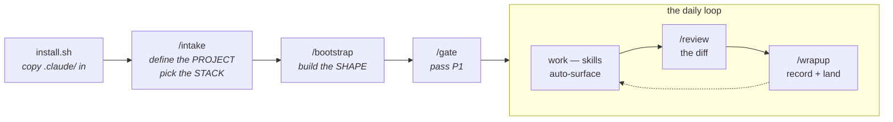

# claude-for-datascience

[](https://github.com/BrendenKennedy/claude-for-datascience/actions/workflows/ci.yml)
[](LICENSE)
[](https://github.com/BrendenKennedy/claude-for-datascience/releases)

An opinionated [Claude Code](https://claude.com/claude-code) configuration for data-science
projects, end to end: problem definition → data acquisition → EDA → labeling → training →
evaluation → reporting → serving → monitoring, run on a **phase-gate project framework**
([`PROCESS.md`](PROCESS.md)) with skills, subagents, hooks, and cross-session memory doing the work.

**Why.** Out of the box, a coding agent knows nothing about how ML projects go wrong: it will write
an unseeded training run, tune a threshold on the test set, hardcode a dataset path, and forget all
of it by the next session. Teaching it your conventions is possible — Claude Code reads project
config from `.claude/` — but authoring that config is its own project. This repo is that project,
done.

**How.** `CLAUDE.md` is deliberately an *index*, not an instruction manual — a one-page map that
loads every session and points at the substance. Domain knowledge lives in 30+ **skills** that load
on demand and only when relevant: the dataset-splitting skill surfaces when you're splitting data,
and whole *lanes* (tabular, time-series, LLM fine-tuning) stay off unless your project is in them.
The project itself advances through **gated phases** — `/gate` reviews evidence, not vibes, and
`/report` drafts deliverables whose every number traces to a tracked run. Rules that must not be
broken are **hooks**, not prose: a session cannot end while a data-leakage test fails. Decisions
persist in a **memory** directory instead of evaporating with the context window.

> **Default lane:** PyTorch CV on an NVIDIA GPU (local or over SSH), `uv` for environments,
> MLflow · Hydra · DVC as the stack. `/intake` swaps the stack and flips on other lanes
> (tabular · time-series · LLM fine-tune/eval · SQL · serving) by asking what you're building.

## Quick start

Prerequisites: [Claude Code](https://claude.com/claude-code), `git`, `bash`, [`uv`](https://docs.astral.sh/uv/).

```bash
# 1. Get the scaffold (once; reuse for every project)
git clone https://github.com/BrendenKennedy/claude-for-datascience.git ~/dev/claude-for-datascience

# 2. Install into your project (never overwrites existing files; safe to re-run)
cd ~/path/to/my-project
~/dev/claude-for-datascience/install.sh .
```

Then, inside Claude Code:

```
/setup       # the whole sequence, one guided session — or run the pieces yourself:
/intake      #   defines the PROJECT ("what are we building?") + picks your STACK
/bootstrap   #   builds the SHAPE  (conf/ tree · entry points · tests — and proves they run)
/gate        #   reviews the P1 exit gate against the definition doc
```

Or skip the clone: this is a GitHub template — hit **"Use this template"** to start a new project
from it directly.

## How it works



| Layer | What it does |
|---|---|
| **Process** | The project runs on [`PROCESS.md`](PROCESS.md) — a hybrid of CRISP-DM/TDSP/CRISP-ML(Q) with written exit gates per phase. `/gate` reviews evidence and refuses to advance on unchecked items; ad-hoc asks ("plot this CSV") skip the ceremony entirely. |
| **Skills** | On-demand playbooks, loaded only when relevant. Three groups: always-on (chassis + core DS workflow), tool-gated (MLflow ↔ W&B, Hydra ↔ OmegaConf — each version-**pinned**, `/skill-update` syncs them to your installed dep), and lane-gated (tabular, time-series, LLM, SQL, serving — flipped by what you're building). |
| **Subagents** | Specialists to delegate to — data engineering, model building, error analysis, diff review with an ML lens — each preloaded with the skills its job depends on. |
| **Hooks** | Enforcement around tool calls: deps must go through `uv`, notebooks commit clean, secrets can't be written, leakage tests gate session end. |
| **Commands** | `/setup` → `/intake` + `/bootstrap` (one-time), `/gate` (phase reviews), `/report` (evidence-cited deliverables), `/skill-update` (tool-skill maintenance), `/review` + `/wrapup` (the daily loop). |
| **Memory** | Session summaries, roadmap, reference notes, policy canon, and live process state (phase, risks, scope, decisions) — pulled on demand, never auto-loaded. |

## What's in the box

```
.claude/
├── settings.json             # permissions + hook wiring + skillOverrides
├── agents/                   # code-reviewer · software-architect · ml-engineer
│                             #   · eval-analyst · data-engineer · _TEMPLATE
├── skills/
│   ├── (chassis)             # process · governance · memory · testing · wave-planning
│   ├── (CV/DS domain)        # datasets · eda · annotation · training · evaluation · statistics
│   │                         #   · visualization · pipelines · notebooks · reporting
│   ├── (tool, /intake-gated) # env-uv · tracking-mlflow · tracking-wandb · config-hydra
│   │                         #   · config-omegaconf · data-dvc · hpo-optuna — version-pinned;
│   │                         #     /skill-update syncs them to the installed dep
│   ├── (lane, /intake-gated) # tabular · timeseries · wrangling · sql · data-acquisition
│   │                         #   · finetune-unsloth · llm-eval · serving · monitoring
│   │                         #   · infra-aws (least-privilege IAM role) · containers (Docker/Compose)
│   │                         #   · local-stack (offline twins: MinIO · CVAT · Postgres+extensions)
│   │                         #   — flipped by project archetype, so a CV user never pays for them
│   └── _example/             # how to write a skill
├── commands/                 # setup · intake · bootstrap · gate · skill-update · report · review
│                             #   · wrapup · _TEMPLATE
├── hooks/
│   ├── validate-python.py    # ruff format + check on every edited .py
│   ├── validate-bash.sh      # blocks rm -rf of root/home
│   ├── guard-pyproject.py    # dependency edits must go through `uv add`
│   ├── guard-notebook-outputs.py  # .ipynb writes must be output-stripped
│   ├── guard-secrets.py      # blocks writes containing credential-shaped tokens
│   └── run-leakage-tests.sh  # leakage tests run at session end; red blocks the stop
├── scripts/                  # helpers used by hooks/commands
├── templates/                # files /bootstrap copies into the target project
└── memory/                   # sessions/ · roadmap.md · reference/ · policy/ (governance canon)
                              #   · process/ (live phase state, risks, scope, decisions)
CLAUDE.md                     # the index (all that loads every session)
PROCESS.md                    # the phase-gate framework — phases P1–P7, exit gates, templates
install.sh                    # the drop-in installer (ships all of the above)
```

<details>
<summary><b>What /bootstrap generates</b> (interviews you for the CV task, then emits the skeleton to match)</summary>

The task answer genuinely reshapes the output — anomaly detection is not classification with the
labels renamed, and a fit-not-trained method (PatchCore, PaDiM) gets a `fit.py` with no optimizer or
epoch loop at all. Classification default:

```
conf/                      # Hydra config — every knob lives here, never in code
  config.yaml              #   defaults list + run-wide values (seed, device, ckpt, resume)
  model/<backbone>.yaml    #   + optimizer/ scheduler/ dataset/<name>.yaml groups
src/<pkg>/
  env.py                   # load_env() — dotenv, called once at each entry point's top
  seed.py                  # seed_everything() — THE one definition of "seeded"
  train.py                 # @hydra.main entry point; eval.py is its own entry, never a tail
  data/splits.py           # SPLIT_SEED (fixed, NOT cfg.seed) + the split manifest
  data/dataset.py          # torch Dataset + transforms
  models/factory.py        # build_model(cfg) -> nn.Module
models/                    # checkpoints: best.pt, last.pt (data-versioned, not git)
tests/                     # tiny-data smoke + determinism + split-leakage tests
```

Plus the delivery files: `.env.example`, `.pre-commit-config.yaml`, and a CI workflow running the
offline test tier. `/bootstrap` runs the result before it reports success — a real fit/train, an
eval that re-loads the checkpoint, a resume.

</details>

## Daily usage

- **Describe the work; skills surface themselves.** "How do I resume from the last checkpoint?"
  loads `training`; "split this new dataset" loads `datasets` with the leakage rules. If the right
  one isn't surfacing, name it.
- **Delegate to subagents.** "Have the data-engineer wire up the new annotations." "Get the
  eval-analyst to break the metric down per class."
- **`/gate` at phase boundaries** — the exit-gate review, demanding evidence per item; unchecked
  items become named gate debt instead of silent scope-slide. One-off asks skip all of this.
- **`/review` before you commit** — the working-tree diff, with the ML lens (device/dtype, shapes,
  leakage, seeds).
- **`/report` when someone needs the story** — a stakeholder summary, white paper, or model card
  assembled from the repo's records; every number cites a run id, gaps become TODOs.
- **`/wrapup` when you stop** — records a session summary (including the current phase + gate
  debt), updates the roadmap, lands the branch. Next session, "what did we decide about the crop
  padding?" has an answer.

## A project, end to end

<details>
<summary><b>What a real project looks like running through the scaffold</b> (illustrative — a widget defect detector)</summary>

**Day 1 — `/setup`.** The definition interview opens: *"so what are we building?"* You describe
defect detection on a factory line. It classifies the archetype (CV, in-lane), fills the T1
problem statement conversationally, and pushes back where it should:

> *"You said accuracy as the metric — the line runs 99.5% good parts, so 'call everything good'
> scores 99.5%. Typical practice here is per-defect recall at a fixed false-alarm rate, plus
> calibration if the score gates shipments. Are you sure?"*

The challenged decision lands in `memory/process/decision-log.md`. The stack interview confirms
defaults, `/bootstrap` generates the skeleton **and proves it** (a real train/eval/resume on
synthetic data — the report shows the tracker run id), and `/gate` passes P1 with the definition
doc as evidence. Three checkpoint commits exist; `/wrapup` records the session.

**Week 1 — data work.** "Split this new dataset" surfaces `datasets` (group-split, because
multiple images share a part) and `eda` (the sample grids catch a camera whose images are 2×
darker — logged to the risk register). Labeling starts spec-first via `annotation`: the pilot's
inter-annotator agreement misses the written threshold, the spec gains two occlusion rulings,
the re-pilot clears. `/gate` P2: **BLOCKED** — the label-error audit hasn't run. That's gate
debt, recorded by name; work continues inside the phase, and nothing slides forward silently.

**Week 3 — modeling.** `training` + `tracking-mlflow` conventions mean every run is seeded,
config-snapshotted, and comparable. A promising +1.2 mAP "win" dies in review: `statistics`'
seed-variance check shows ±1.5 across seeds. The experiment budget (written at P1, hardened at
P5) says 40 GPU-hours remain — the sweep gets pruned accordingly.

**Week 5 — ship it.** `/gate` P5 passes with the error analysis as evidence (`eval-analyst`
produced it citable). `/report stakeholder` assembles the summary from the repo's records —
every number carries a run id, and one claim it can't back becomes `[TODO: evidence — no
per-camera eval run exists]` instead of a plausible guess. The registry alias moves only after
the model card exists. `monitoring` flips on in `skillOverrides`, prediction logging wired
before launch.

The through-line: **nothing above relied on anyone remembering to be careful.** The interview
challenged the metric, the gate refused the unaudited labels, the noise floor killed the fake
win, and the report refused to invent the missing number — all structural.

</details>

## After installing

1. `/setup` — or `/intake`, `/bootstrap`, `/gate` piecewise (see Quick start).
2. Fill the `<PLACEHOLDER>`s the setup commands list — the ones needing *your* decisions: the
   architecture doc, the policy domains in `memory/policy/`, the data-remote URL.
3. Build real skills/agents from `_example/` and `_TEMPLATE.md`, then delete the leftovers.

<details>
<summary><b>Troubleshooting</b></summary>

- **A skill isn't surfacing** — check `skillOverrides` in `settings.json` (tool *and lane* skills
  are gated; your lane may be off), or name the skill explicitly. For your own skills, pack the frontmatter `description` with the
  words you'd actually type — matching happens on that text alone.
- **MLflow file-store error on startup** — MLflow 3.x needs a database URI (`sqlite:///mlflow.db`),
  not `./mlruns`. See the `tracking-mlflow` skill.
- **`${oc.env:DATA_ROOT}` resolves empty** — Hydra reads the *process* env, not `.env`; the entry
  point must call `load_env()` first (`/bootstrap` emits `src/<pkg>/env.py` for this).
- **`torch.cuda.is_available()` is False** — wrong wheel for your CUDA/arch (common on ARM). The
  `env-uv` skill carries the torch-index matrix and sanity check.
- **Permission prompts on everything** — extend `permissions.allow` in `.claude/settings.json`.
- **`install.sh` says "skip (exists)"** — the never-clobber guarantee; delete a file first if you
  want the scaffold's copy.

</details>

## Security model

**The hooks are guardrails against agent *mistakes*, not a
sandbox against an adversary.** They pattern-match and fail open; a determined bypass defeats them.
The actual security boundary is Claude Code's permission system (the `settings.json` allow/deny
lists) and whatever OS-level isolation you run.

What is enforced today: destructive-but-legitimate operations (recursive deletes, `git reset
--hard`, force-push, deleting datasets/checkpoints) trigger a confirmation dialog that fires in
*every* permission mode — including `bypassPermissions` — via the hook `permissionDecision: ask`
mechanism, piping a download into a shell is blocked outright, secrets stay out of the transcript (`.env` reads are denied on both the Read
and shell paths), credential-shaped tokens can't be written into tracked files (`guard-secrets.py`,
plus gitleaks on human commits via the pre-commit template), dependencies only enter through
`uv add`, notebook outputs never reach git, and `git push` is deliberately absent from the
allow-list — landing work remotely is always an explicit user ask.

The full threat model and the org-specific slots (secret manager, approved egress destinations) live
in `.claude/memory/policy/security.md`, governed like everything else through the `governance` skill.

## Contributing

PRs welcome — [CONTRIBUTING.md](CONTRIBUTING.md) has the bar (short version: earn the always-on
surface, stay in the description budget, pin tool facts, register everything, and
`check-scaffold.sh` must pass). Architecture debates start from the recorded decisions in
`.claude/memory/reference/`.

## License

MIT — see [LICENSE](LICENSE).
