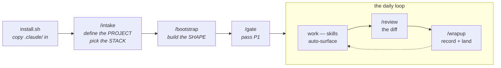

# claude-for-datascience

[](https://github.com/BrendenKennedy/claude-for-datascience/actions/workflows/ci.yml)
[](LICENSE)
[](https://github.com/BrendenKennedy/claude-for-datascience/releases)

A drop-in [Claude Code](https://claude.com/claude-code) configuration that turns a coding agent
into a disciplined data-science collaborator. Four ideas:

- **Process** — projects run on [`PROCESS.md`](PROCESS.md): phases with written exit gates.
  `/gate` reviews evidence and refuses to advance on unchecked items; ad-hoc questions
  ("plot this CSV") skip the ceremony entirely.
- **Knowledge** — 34 skills load on demand, never all at once. Archetypes (CV · tabular ·
  time-series · LLM · …) are *lanes* you flip on, so you never pay context for someone
  else's domain.
- **Enforcement** — rules that must hold are hooks and permissions, not prose: leakage tests
  gate session end, secrets can't be written, deps go through `uv`, destructive commands get a
  confirm dialog.
- **Memory** — decisions, phase state, risks, and session notes persist in-repo, and every
  number in a `/report` traces to a tracked run.

## Quick start

Prerequisites: [Claude Code](https://claude.com/claude-code), `git`, `bash`, [`uv`](https://docs.astral.sh/uv/).

```bash
git clone https://github.com/BrendenKennedy/claude-for-datascience.git ~/dev/claude-for-datascience
cd ~/path/to/my-project
~/dev/claude-for-datascience/install.sh .   # never overwrites; safe to re-run
```

Then, inside Claude Code:

```
/setup       # the whole sequence, one guided session — or run the pieces yourself:
/intake      #   defines the PROJECT ("what are we building?") + picks your STACK
/bootstrap   #   builds the SHAPE  (conf/ tree · entry points · tests — and proves they run)
/gate        #   reviews the P1 exit gate against the definition doc
```

Or hit **"Use this template"** on GitHub to start a repo from it directly.

**Docs:** [TUTORIAL.md](docs/TUTORIAL.md) — first project, hands-on, ~30 min, no dataset
needed · [REFERENCE.md](docs/REFERENCE.md) — every skill, command, agent, and hook, one line
each (generated from source, so it can't drift).

## Use it for — and what it doesn't replace

**Use it for:** running a DS project end to end (define → data → model → evaluate → report →
ship → monitor) with the discipline enforced instead of remembered · quick ad-hoc analysis
with honesty rules but zero ceremony · carrying one set of conventions across every project
and teammate session.

**It does not aim to replace:**

- **Your tools.** MLflow/W&B, Hydra, DVC, Docker, AWS — the scaffold *drives* them with
  version-pinned, correct usage (`/skill-update` keeps the facts current). It is not a
  tracker, a versioner, or a cloud.
- **Your judgment.** Gates need a human verdict; the interview challenges your choices but
  you decide; IAM policies and label specs get reviewed by you. This is not an autopilot
  from prompt to shipped model.
- **A data platform.** No orchestrator, warehouse, or feature store inside — the infra lanes
  connect to yours (or stand up local twins for offline work).
- **Learning the craft.** It enforces good practice and explains its reasoning, but it's a
  practitioner's harness, not a course.

## How it works



| Layer | What it does |
|---|---|
| **Process** | [`PROCESS.md`](PROCESS.md) — CRISP-DM/TDSP/CRISP-ML(Q) hybrid with per-phase exit gates, enforced by `/gate`. |
| **Skills** | On-demand playbooks in three tiers: always-on DS core, tool-gated (MLflow ↔ W&B, version-**pinned**), lane-gated by archetype. |
| **Subagents** | Specialists — data engineering, model building, error analysis, review with an ML lens — preloaded with the skills their job needs. |
| **Hooks** | Deterministic enforcement around tool calls; the security floor. |
| **Commands** | One-time setup (`/setup`, `/intake`, `/bootstrap`), reviews (`/gate`, `/review`), deliverables (`/report`), maintenance (`/skill-update`, `/upgrade`, `/scaffold-retro`), close-out (`/wrapup`). |
| **Memory** | Session notes, roadmap, scaffold journal, policy canon, live process state — pulled on demand, never auto-loaded. |

Stack defaults: `uv` · MLflow · Hydra · DVC — swappable at `/intake`. No archetype is
privileged (one caveat: `/bootstrap`'s generated skeleton is currently the deep-learning
shape; other archetype skeletons are on the roadmap).

## Daily usage

- **Describe the work; skills surface themselves** — "split this new dataset" loads the split
  discipline; name a skill if the right one doesn't appear.
- **`/gate` at phase boundaries** — unchecked items become named gate debt, not silent
  scope-slide. Expect your first BLOCKED verdict early; that's the system working.
- **`/review` before you commit · `/wrapup` when you stop** — the diff gets the ML lens;
  the session gets recorded so next time "what did we decide?" has an answer.
- **`/report` when someone needs the story** — assembled from the repo's records; evidence
  gaps become TODOs, never plausible numbers.

<details>
<summary><b>What's in the box</b> — the full tree</summary>

```
.claude/
├── settings.json             # permissions + hook wiring + skillOverrides
├── agents/                   # code-reviewer · software-architect · ml-engineer
│                             #   · eval-analyst · data-engineer · _TEMPLATE
├── skills/
│   ├── (chassis)             # process · governance · memory · testing · wave-planning
│   ├── (DS core, always-on)  # datasets · eda · evaluation · statistics · visualization
│   │                         #   · notebooks · reporting
│   ├── (tool, /intake-gated) # env-uv · tracking-mlflow · tracking-wandb · config-hydra
│   │                         #   · config-omegaconf · data-dvc · hpo-optuna — version-pinned;
│   │                         #     /skill-update syncs them to the installed dep
│   ├── (lane, /intake-gated) # cv (annotation · pipelines · training) · tabular · timeseries
│   │                         #   · wrangling · sql · data-acquisition
│   │                         #   · finetune-unsloth · llm-eval · serving · monitoring
│   │                         #   · infra-aws (least-privilege IAM role) · containers (Docker/Compose)
│   │                         #   · local-stack (offline twins: MinIO · CVAT · Postgres+extensions)
│   │                         #   — flipped by project archetype
│   └── _example/             # how to write a skill
├── commands/                 # setup · intake · bootstrap · gate · skill-update · upgrade · report
│                             #   · review · wrapup · _TEMPLATE
├── hooks/
│   ├── validate-python.py    # ruff format + check on every edited .py
│   ├── validate-bash.sh      # blocks root/home wipes + .env reads; confirms destructive ops
│   ├── guard-pyproject.py    # dependency edits must go through `uv add`
│   ├── guard-notebook-outputs.py  # .ipynb writes must be output-stripped
│   ├── guard-secrets.py      # blocks writes containing credential-shaped tokens
│   └── run-leakage-tests.sh  # leakage tests run at session end; red blocks the stop
├── scripts/                  # helpers used by hooks/commands (incl. check-scaffold, build-reference)
├── templates/                # starter files for the target project (incl. the AWS IAM policy)
└── memory/                   # sessions/ · roadmap.md · reference/ · policy/ (governance canon)
                              #   · process/ (live phase state, risks, scope, decisions)
CLAUDE.md                     # the index (all that loads every session)
PROCESS.md                    # the phase-gate framework — phases P1–P7, exit gates, templates
install.sh                    # the drop-in installer (ships all of the above)
```

</details>

<details>
<summary><b>What /bootstrap generates</b> (interviews you for the task, then emits the skeleton to match)</summary>

The task answer genuinely reshapes the output — anomaly detection is not classification with the
labels renamed, and a fit-not-trained method (PatchCore, PaDiM) gets a `fit.py` with no optimizer or
epoch loop at all. Classification default:

```
conf/                      # Hydra config — every knob lives here, never in code
  config.yaml              #   defaults list + run-wide values (seed, device, ckpt, resume)
  model/<backbone>.yaml    #   + optimizer/ scheduler/ dataset/<name>.yaml groups
src/<pkg>/
  env.py                   # load_env() — dotenv, called once at each entry point's top
  seed.py                  # seed_everything() — THE one definition of "seeded"
  train.py                 # @hydra.main entry point; eval.py is its own entry, never a tail
  data/splits.py           # SPLIT_SEED (fixed, NOT cfg.seed) + the split manifest
  data/dataset.py          # torch Dataset + transforms
  models/factory.py        # build_model(cfg) -> nn.Module
models/                    # checkpoints: best.pt, last.pt (data-versioned, not git)
tests/                     # tiny-data smoke + determinism + split-leakage tests
```

Plus the delivery files: `.env.example`, `.pre-commit-config.yaml`, and a CI workflow running the
offline test tier. `/bootstrap` runs the result before it reports success — a real fit/train, an
eval that re-loads the checkpoint, a resume.

</details>

<details>
<summary><b>A project, end to end</b> (illustrative — a widget defect detector)</summary>

**Day 1 — `/setup`.** The definition interview opens: *"so what are we building?"* You describe
defect detection on a factory line. It classifies the archetype (CV, in-lane), fills the T1
problem statement conversationally, and pushes back where it should:

> *"You said accuracy as the metric — the line runs 99.5% good parts, so 'call everything good'
> scores 99.5%. Typical practice here is per-defect recall at a fixed false-alarm rate, plus
> calibration if the score gates shipments. Are you sure?"*

The challenged decision lands in `memory/process/decision-log.md`. The stack interview confirms
defaults, `/bootstrap` generates the skeleton **and proves it** (a real train/eval/resume on
synthetic data — the report shows the tracker run id), and `/gate` passes P1 with the definition
doc as evidence. Three checkpoint commits exist; `/wrapup` records the session.

**Week 1 — data work.** "Split this new dataset" surfaces `datasets` (group-split, because
multiple images share a part) and `eda` (the sample grids catch a camera whose images are 2×
darker — logged to the risk register). Labeling starts spec-first via `annotation`: the pilot's
inter-annotator agreement misses the written threshold, the spec gains two occlusion rulings,
the re-pilot clears. `/gate` P2: **BLOCKED** — the label-error audit hasn't run. That's gate
debt, recorded by name; work continues inside the phase, and nothing slides forward silently.

**Week 3 — modeling.** `training` + `tracking-mlflow` conventions mean every run is seeded,
config-snapshotted, and comparable. A promising +1.2 mAP "win" dies in review: `statistics`'
seed-variance check shows ±1.5 across seeds. The experiment budget (written at P1, hardened at
P5) says 40 GPU-hours remain — the sweep gets pruned accordingly.

**Week 5 — ship it.** `/gate` P5 passes with the error analysis as evidence (`eval-analyst`
produced it citable). `/report stakeholder` assembles the summary from the repo's records —
every number carries a run id, and one claim it can't back becomes `[TODO: evidence — no
per-camera eval run exists]` instead of a plausible guess. The registry alias moves only after
the model card exists. `monitoring` flips on in `skillOverrides`, prediction logging wired
before launch.

The through-line: **nothing above relied on anyone remembering to be careful.** The interview
challenged the metric, the gate refused the unaudited labels, the noise floor killed the fake
win, and the report refused to invent the missing number — all structural.

</details>

<details>
<summary><b>Troubleshooting</b></summary>

- **A skill isn't surfacing** — check `skillOverrides` in `settings.json` (tool *and lane* skills
  are gated; your lane may be off), or name the skill explicitly. For your own skills, pack the
  frontmatter `description` with the words you'd actually type — matching happens on that text alone.
- **MLflow file-store error on startup** — MLflow 3.x needs a database URI (`sqlite:///mlflow.db`),
  not `./mlruns`. See the `tracking-mlflow` skill.
- **`${oc.env:DATA_ROOT}` resolves empty** — Hydra reads the *process* env, not `.env`; the entry
  point must call `load_env()` first (`/bootstrap` emits `src/<pkg>/env.py` for this).
- **`torch.cuda.is_available()` is False** — wrong wheel for your CUDA/arch (common on ARM). The
  `env-uv` skill carries the torch-index matrix and sanity check.
- **Permission prompts on everything** — extend `permissions.allow` in `.claude/settings.json`.
- **`install.sh` says "skip (exists)"** — the never-clobber guarantee; delete a file first if you
  want the scaffold's copy.

</details>

## Security model

**The hooks are guardrails against agent *mistakes*, not a sandbox against an adversary** — they
pattern-match and fail open. The boundary is Claude Code's permission system (`settings.json`
allow/deny), OS-level isolation, and — for cloud work — a least-privilege IAM role the agent
structurally cannot widen. Enforced today: destructive ops get a confirm dialog in every
permission mode, secrets stay out of the transcript and out of tracked files, deps enter only
through `uv add`, and `git push` is always an explicit ask. Full threat model:
[`.claude/memory/policy/security.md`](.claude/memory/policy/security.md).

## Contributing

PRs welcome — [CONTRIBUTING.md](CONTRIBUTING.md) has the bar and the stability contract.
Architecture debates start from the recorded decisions in `.claude/memory/reference/`.

## License

MIT — see [LICENSE](LICENSE).
