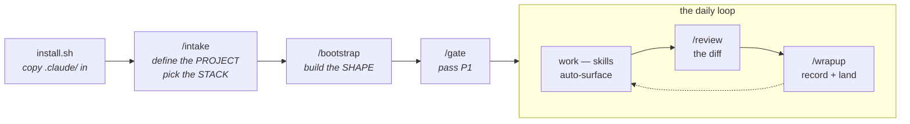

# claude-for-datascience

[](https://github.com/BrendenKennedy/claude-for-datascience/actions/workflows/ci.yml)
[](LICENSE)
[](https://github.com/BrendenKennedy/claude-for-datascience/releases)

An opinionated [Claude Code](https://claude.com/claude-code) configuration for computer-vision and
data-science projects: skills, subagents, hooks, and cross-session memory shaped around the ML loop
— datasets, training, evaluation, experiment tracking.

**Why.** Out of the box, a coding agent knows nothing about how ML projects go wrong: it will write
an unseeded training run, tune a threshold on the test set, hardcode a dataset path, and forget all
of it by the next session. Teaching it your conventions is possible — Claude Code reads project
config from `.claude/` — but authoring that config is its own project. This repo is that project,
done.

**How.** `CLAUDE.md` is deliberately an *index*, not an instruction manual — a one-page map that
loads every session and points at the substance. Domain knowledge lives in ~15 **skills** that load
on demand (the dataset-splitting skill surfaces when you're splitting data, not when you're writing
a README). Rules that must not be broken are **hooks**, not prose: a session cannot end while a
data-leakage test fails. Decisions persist in a **memory** directory instead of evaporating with the
context window. Everything stays in sync because the depth lives in exactly one place.

> **Assumptions (v1):** PyTorch CV, an NVIDIA GPU (local or over SSH), `uv` for environments.
> Default stack: MLflow · Hydra · DVC — swap the tracker in `/intake`.

## Quick start

Prerequisites: [Claude Code](https://claude.com/claude-code), `git`, `bash`, [`uv`](https://docs.astral.sh/uv/).

```bash
# 1. Get the scaffold (once; reuse for every project)
git clone https://github.com/BrendenKennedy/claude-for-datascience.git ~/dev/claude-for-datascience

# 2. Install into your project (never overwrites existing files; safe to re-run)
cd ~/path/to/my-project
~/dev/claude-for-datascience/install.sh .
```

Then, inside Claude Code:

```
/setup       # the whole sequence, one guided session — or run the pieces yourself:
/intake      #   defines the PROJECT ("what are we building?") + picks your STACK
/bootstrap   #   builds the SHAPE  (conf/ tree · entry points · tests — and proves they run)
/gate        #   reviews the P1 exit gate against the definition doc
```

Or skip the clone: this is a GitHub template — hit **"Use this template"** to start a new project
from it directly.

## How it works



| Layer | What it does |
|---|---|
| **Skills** | On-demand playbooks, matched to what you're doing. Two tiers: always-on (process + CV/DS domain) and tool-gated (`/intake` flips MLflow ↔ W&B etc. via `skillOverrides`). |
| **Subagents** | Specialists to delegate to: data engineering, model building, error analysis, diff review with an ML lens. |
| **Hooks** | Enforcement around tool calls: deps must go through `uv`, notebooks commit clean, leakage tests gate session end. |
| **Commands** | `/setup` → `/intake` + `/bootstrap` (one-time setup), `/gate` (phase-gate reviews), `/review` and `/wrapup` (the daily loop). |
| **Memory** | Session summaries, roadmap, reference notes, policy canon — pulled on demand, never auto-loaded. |

## What's in the box

```
.claude/
├── settings.json             # permissions + hook wiring + skillOverrides
├── agents/                   # code-reviewer · software-architect · ml-engineer
│                             #   · eval-analyst · data-engineer · _TEMPLATE
├── skills/
│   ├── (chassis)             # process · governance · memory · testing · wave-planning
│   ├── (CV/DS domain)        # datasets · annotation · training · evaluation · pipelines · notebooks
│   ├── (tool, /intake-gated) # env-uv · tracking-mlflow · config-hydra · data-dvc · tracking-wandb
│   └── _example/             # how to write a skill
├── commands/                 # setup · intake · bootstrap · gate · review · wrapup · _TEMPLATE
├── hooks/
│   ├── validate-python.py    # ruff format + check on every edited .py
│   ├── validate-bash.sh      # blocks rm -rf of root/home
│   ├── guard-pyproject.py    # dependency edits must go through `uv add`
│   ├── guard-notebook-outputs.py  # .ipynb writes must be output-stripped
│   ├── guard-secrets.py      # blocks writes containing credential-shaped tokens
│   └── run-leakage-tests.sh  # leakage tests run at session end; red blocks the stop
├── scripts/                  # helpers used by hooks/commands
├── templates/                # files /bootstrap copies into the target project
└── memory/                   # sessions/ · roadmap.md · reference/ · policy/
CLAUDE.md                     # the index (all that loads every session)
install.sh                    # the drop-in installer
```

<details>
<summary><b>What /bootstrap generates</b> (interviews you for the CV task, then emits the skeleton to match)</summary>

The task answer genuinely reshapes the output — anomaly detection is not classification with the
labels renamed, and a fit-not-trained method (PatchCore, PaDiM) gets a `fit.py` with no optimizer or
epoch loop at all. Classification default:

```
conf/                      # Hydra config — every knob lives here, never in code
  config.yaml              #   defaults list + run-wide values (seed, device, ckpt, resume)
  model/<backbone>.yaml    #   + optimizer/ scheduler/ dataset/<name>.yaml groups
src/<pkg>/
  env.py                   # load_env() — dotenv, called once at each entry point's top
  seed.py                  # seed_everything() — THE one definition of "seeded"
  train.py                 # @hydra.main entry point; eval.py is its own entry, never a tail
  data/splits.py           # SPLIT_SEED (fixed, NOT cfg.seed) + the split manifest
  data/dataset.py          # torch Dataset + transforms
  models/factory.py        # build_model(cfg) -> nn.Module
models/                    # checkpoints: best.pt, last.pt (data-versioned, not git)
tests/                     # tiny-data smoke + determinism + split-leakage tests
```

Plus the delivery files: `.env.example`, `.pre-commit-config.yaml`, and a CI workflow running the
offline test tier. `/bootstrap` runs the result before it reports success — a real fit/train, an
eval that re-loads the checkpoint, a resume.

</details>

## Daily usage

- **Describe the work; skills surface themselves.** "How do I resume from the last checkpoint?"
  loads `training`; "split this new dataset" loads `datasets` with the leakage rules. If the right
  one isn't surfacing, name it.
- **Delegate to subagents.** "Have the data-engineer wire up the new annotations." "Get the
  eval-analyst to break the metric down per class."
- **`/review` before you commit** — the working-tree diff, with the ML lens (device/dtype, shapes,
  leakage, seeds).
- **`/wrapup` when you stop** — records a session summary, updates the roadmap, lands the branch.
  Next session, "what did we decide about the crop padding?" has an answer.

## After installing

1. `/setup` — or `/intake`, `/bootstrap`, `/gate` piecewise (see Quick start).
2. Fill the `<PLACEHOLDER>`s the two commands list — the ones needing *your* decisions: the
   architecture doc, the policy domains in `memory/policy/`, the data-remote URL.
3. Build real skills/agents from `_example/` and `_TEMPLATE.md`, then delete the leftovers.

<details>
<summary><b>Troubleshooting</b></summary>

- **A skill isn't surfacing** — check `skillOverrides` in `settings.json` (tool skills are gated),
  or name the skill explicitly. For your own skills, pack the frontmatter `description` with the
  words you'd actually type — matching happens on that text alone.
- **MLflow file-store error on startup** — MLflow 3.x needs a database URI (`sqlite:///mlflow.db`),
  not `./mlruns`. See the `tracking-mlflow` skill.
- **`${oc.env:DATA_ROOT}` resolves empty** — Hydra reads the *process* env, not `.env`; the entry
  point must call `load_env()` first (`/bootstrap` emits `src/<pkg>/env.py` for this).
- **`torch.cuda.is_available()` is False** — wrong wheel for your CUDA/arch (common on ARM). The
  `env-uv` skill carries the torch-index matrix and sanity check.
- **Permission prompts on everything** — extend `permissions.allow` in `.claude/settings.json`.
- **`install.sh` says "skip (exists)"** — the never-clobber guarantee; delete a file first if you
  want the scaffold's copy.

</details>

## Security model

**the hooks are guardrails against agent *mistakes*, not a 
sandbox against an adversary.** They pattern-match and fail open; a determined bypass defeats them.
The actual security boundary is Claude Code's permission system (the `settings.json` allow/deny
lists) and whatever OS-level isolation you run.

What is enforced today: destructive-but-legitimate operations (recursive deletes, `git reset
--hard`, force-push, deleting datasets/checkpoints) trigger a confirmation dialog that fires in
*every* permission mode — including `bypassPermissions` — via the hook `permissionDecision: ask`
mechanism, piping a download into a shell is blocked outright, secrets stay out of the transcript (`.env` reads are denied on both the Read
and shell paths), credential-shaped tokens can't be written into tracked files (`guard-secrets.py`,
plus gitleaks on human commits via the pre-commit template), dependencies only enter through
`uv add`, notebook outputs never reach git, and `git push` is deliberately absent from the
allow-list — landing work remotely is always an explicit user ask.

The full threat model and the org-specific slots (secret manager, approved egress destinations) live
in `.claude/memory/policy/security.md`, governed like everything else through the `governance` skill.

## License

MIT — see [LICENSE](LICENSE).
